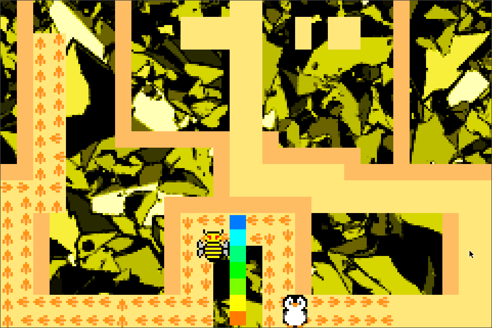

penguin-feet
============

Overview
--------

A 2D top-down technical demo where you play as a "penguin".

Gameplay features are largely inspired by the "Cub Chase" game from "The Lion King 2: Simba's Pride GameBreak (1998)".

I suspect "Cub Chase" in turn was originally envisioned as a Lion King -themed Pac-Man clone.

Details
-------

The game is mostly interesting due to its lack of run-time dependencies:

- no dependency on a game engine
- no dependency on an operating system

The tooling is also interesting; the build-time dependencies are:

- arm-none-eabi- gcc
- arm-none-eabi- binutils
- GNU Make
- Python (~>3.4)

Emulator/hardware compatibility
-------------------------------

penguin-feet is known to work well on at least:

- mGBA
- VBA-M
- mGBA (Nintendo Switch)
- open_agb_firm (Nintendo 3DS)
- Nintendo DS
- Game Boy Advance
- likely others

penguin-feet is known to be completely non-functional on:

- Virtual Console (Nintendo 3DS)

Prior work
----------

The "registers.h" file from the penguin-feet repository is a derivative of "regs.h" from

https://github.com/buhman/snake-gba/tree/3d60b59/regs.h

This means work on "registers.h" from penguin-feet started prior to the start date of the game jam.

All other files were authored after the start of the jam.
